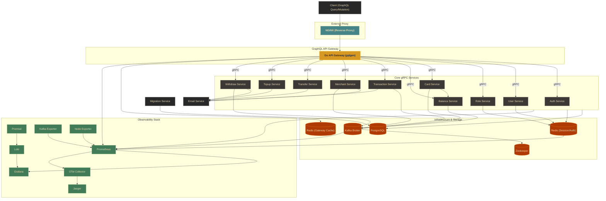
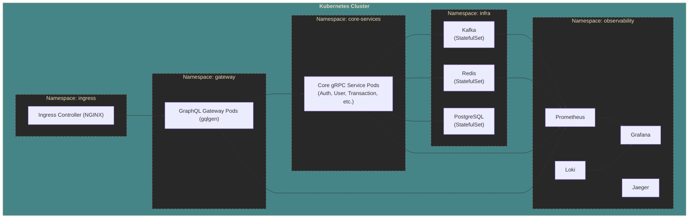
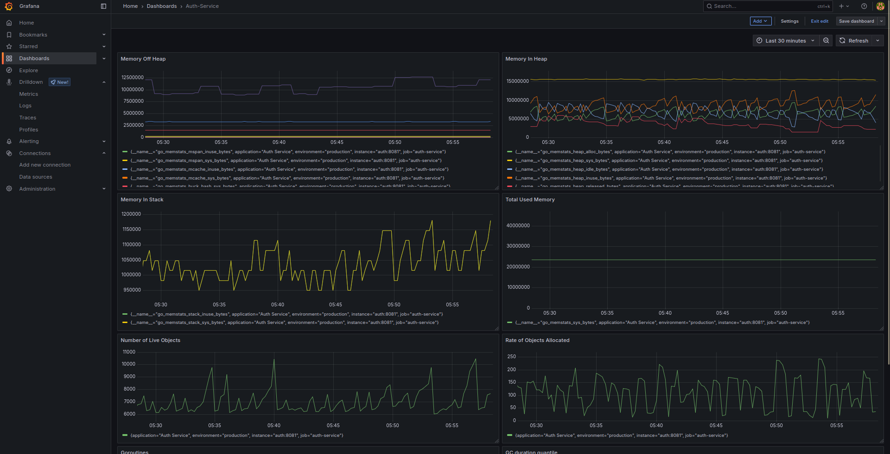
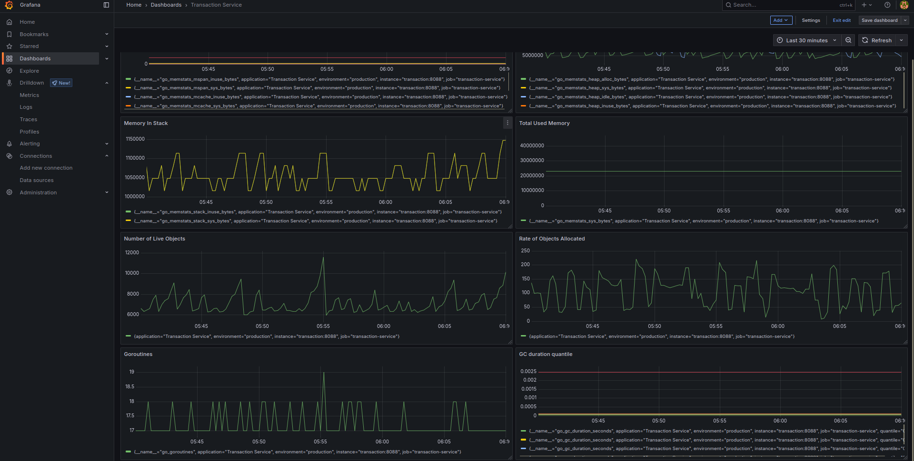
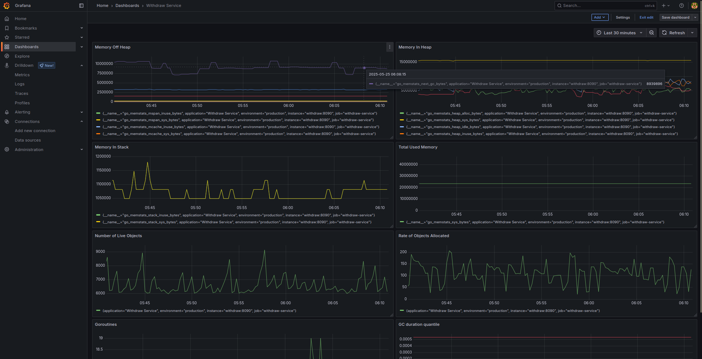

# Distributed Modular Monolith Payment Gateway — GraphQL & gRPC

A production-grade **Distributed Modular Monolith Payment Gateway** built with **Go**, exposing a **GraphQL API** to external clients and using **gRPC** for high-performance inter-service communication.

The architecture strikes a balance between monolithic simplicity and microservice scalability. All domain modules — Auth, User, Role, Card, Balance, Transaction, Merchant, Transfer, Topup, and Withdraw — live in a single repository but are deployed as independent containers with well-defined boundaries.

---

## Highlights

| Layer | Technology |
|---|---|
| **External API** | GraphQL (gqlgen) |
| **Inter-Service** | gRPC + Protobuf |
| **Event Bus** | Apache Kafka |
| **Database** | PostgreSQL (sqlc) |
| **Cache / Sessions** | Redis |
| **Observability** | OpenTelemetry · Prometheus · Grafana · Loki · Jaeger |
| **Gateway Proxy** | NGINX (reverse proxy / SSL termination) |

---

## Architecture

### Design Principles

1. **GraphQL API Gateway** — A single Go service (powered by [gqlgen](https://gqlgen.com/)) receives all client queries and mutations. It validates input, enforces authentication / RBAC, and orchestrates responses by aggregating data from multiple backend gRPC services.
2. **gRPC Backend Services** — Each domain module exposes strongly-typed Protobuf services. The API Gateway is the sole gRPC client; modules never talk to clients directly.
3. **Event-Driven Side-Effects** — Kafka decouples write-heavy workflows (settlement, notifications, balance updates) from the request path.
4. **NGINX Front Proxy** — Handles SSL termination, rate-limiting, and load-balancing before traffic reaches the GraphQL gateway.
5. **Centralized Observability** — Every service exports metrics, logs, and traces via OpenTelemetry, visualized in Grafana dashboards.

### Request Flow

```
Client ──▶ NGINX ──▶ GraphQL API Gateway (gqlgen)
                          │
                  ┌───────┼────────────────────────────┐
                  ▼       ▼       ▼       ▼            ▼
              Auth    User    Card   Transaction   ... (gRPC)
              gRPC    gRPC    gRPC     gRPC
                  │       │       │       │
                  └───────┴───────┴───────┘
                              │
                        PostgreSQL / Redis / Kafka
```

### System Component Diagram (Local Development)



### Kubernetes Deployment Topology



---

## GraphQL Schema

The API Gateway exposes a rich, strongly-typed GraphQL API. Schema files live in `service/apigateway/graphql/`:

| Schema File | Domain | Operations |
|---|---|---|
| `auth.graphqls` | Authentication | Login, Register, Refresh Token, Forgot/Reset Password, Verify Code |
| `user.graphqls` | Users | CRUD, Profile lookup |
| `role.graphqls` | Roles & RBAC | Role management with Redis-cached permission lookups |
| `card.graphqls` | Cards | Card lifecycle, dashboard stats, balance/topup/transaction/transfer/withdraw analytics |
| `saldo.graphqls` | Balance | Balance queries, stats, total balance aggregations |
| `transaction.graphqls` | Transactions | Payment creation/settlement/refund, monthly/yearly analytics by method/status/amount |
| `merchant.graphqls` | Merchants | Onboarding, verification, transaction stats |
| `merchantdocument.graphqls` | Merchant Docs | Document upload/management |
| `topup.graphqls` | Top-up | Account funding, stats by amount/method/status |
| `transfer.graphqls` | Transfer | P2P & merchant transfers, analytics |
| `withdraw.graphqls` | Withdrawal | Withdraw management, stats by amount/status |
| `common.graphqls` | Shared Types | `PaginationMeta` and other common types |

### Example Query

```graphql
query {
  findAllTransaction(input: { page: 1, page_size: 10, search: "" }) {
    status
    message
    data {
      id
      card_number
      transaction_no
      amount
      payment_method
      merchant_id
      transaction_time
    }
    pagination {
      current_page
      page_size
      total_pages
      total_records
    }
  }
}
```

### Example Mutation

```graphql
mutation {
  loginUser(input: { email: "user@example.com", password: "secret" }) {
    status
    message
    data {
      access_token
      refresh_token
    }
  }
}
```

---

## gRPC Services (Backend)

Each domain module runs as an independent gRPC server. Proto definitions are located in `proto/` and generated Go code in `pb/`.

| Service | Proto | gRPC Interfaces |
|---|---|---|
| Auth | `auth.proto` | `AuthService` |
| User | `user/` | `UserQueryService`, `UserCommandService` |
| Role | `role/` | `RoleService`, `RoleCommandService` |
| Card | `card/` | `CardQueryService`, `CardCommandService`, `CardDashboardService`, + Stats services |
| Merchant | `merchant/` | `MerchantQueryService`, `MerchantCommandService`, `MerchantTransactionService`, + Stats services |
| Merchant Document | `merchant_document/` | `MerchantDocumentQueryService`, `MerchantDocumentCommandService` |
| Balance (Saldo) | `saldo/` | `SaldoQueryService`, `SaldoCommandService`, + Stats services |
| Topup | `topup/` | `TopupQueryService`, `TopupCommandService`, + Stats services |
| Transaction | `transaction/` | `TransactionQueryService`, `TransactionCommandService`, + Stats services |
| Transfer | `transfer/` | `TransferQueryService`, `TransferCommandService`, + Stats services |
| Withdraw | `withdraw/` | `WithdrawQueryService`, `WithdrawCommandService`, + Stats services |

---

## Key Features

### Authentication & Access Control
*   JWT-based authentication with access + refresh token pairs.
*   Granular Role-Based Access Control (RBAC) — Admin, Merchant, Customer, System roles.
*   Kafka-driven permission resolution with Redis caching for low-latency lookups.

### Card & Balance Management
*   Full card lifecycle management (registration, activation, deactivation).
*   Event-driven balance updates triggered by card activities via Kafka.
*   Dashboard analytics: balance stats, topup/transfer/withdraw/transaction amounts per card.

### Transaction Processing
*   Comprehensive payment creation, settlement, and refund workflows.
*   Merchant API key validation with Kafka-based permission checks.
*   Monthly/yearly analytics by payment method, status (success/failed), and amount.
*   Real-time transaction confirmations delivered via email.

### Financial Operations
*   Peer-to-peer and merchant transfer services.
*   Account funding via dedicated top-up services.
*   Merchant and customer withdrawal management.
*   Automated email notifications for all financial operations.

### Merchant Services
*   Onboarding and verification workflows with document management.
*   Automated status updates and document processing.
*   Integrated settlement flows connected to Transaction and Balance services.

### Event-Driven Architecture
*   Decoupled service interaction using Kafka.
*   Background processing for non-blocking operations (settlements, notifications).
*   Optimized data access using Redis caching.

### System Observability
*   Standardized metrics collection via Prometheus.
*   Log aggregation and querying using Promtail and Loki.
*   Distributed tracing with OpenTelemetry and Jaeger.
*   Pre-configured Grafana dashboards for system health visualization.

---

## Technical Stack

| Category | Technologies |
|---|---|
| **Language** | Go (Golang) |
| **External API** | GraphQL ([gqlgen](https://gqlgen.com/)) |
| **Inter-Service** | gRPC + Protocol Buffers |
| **Event Streaming** | Apache Kafka |
| **Database** | PostgreSQL |
| **SQL Codegen** | sqlc |
| **Migrations** | Goose |
| **Cache / Sessions** | Redis |
| **Observability** | OpenTelemetry, Prometheus, Grafana, Loki, Promtail, Jaeger |
| **Logging** | Zap (structured) |
| **Validation** | go-playground/validator |
| **Reverse Proxy** | NGINX |
| **Containerization** | Docker, Docker Compose |
| **Orchestration** | Kubernetes (Minikube for local) |

---

## Getting Started

### Prerequisites

*   Git
*   Go 1.20+
*   Docker & Docker Compose
*   Make (or [just](https://github.com/casey/just))
*   `protoc` with Go/gRPC plugins (for proto generation)

### Installation

1.  **Clone the Repository**
    ```bash
    git clone https://github.com/MamangRust/monolith-graphql-payment-gateway-grpc.git
    cd monolith-graphql-payment-gateway-grpc
    ```

2.  **Environment Configuration**
    *   Create a `.env` file in the root directory for general settings.
    *   Create a `docker.env` file in `deployments/local/` for Docker-specific configurations.

3.  **Run the Application**
    Initialize the infrastructure and start the services:
    ```bash
    make build-up
    ```

4.  **Database Migration**
    Apply the database schema:
    ```bash
    make migrate
    ```

5.  **Seed Data (Optional)**
    Populate the database with initial test data:
    ```bash
    make seeder
    ```

6.  **Access GraphQL Playground**
    Once the API Gateway is running, open the GraphQL Playground in your browser:
    ```
    http://localhost:<GATEWAY_PORT>/
    ```
    The gqlgen playground provides interactive schema exploration, auto-complete, and query execution.

Check service status using `make ps`.

### Stopping the Application

```bash
make down
```

---

## Project Structure

```
.
├── proto/                          # Protobuf definitions (gRPC contracts)
│   ├── auth.proto
│   ├── card/
│   ├── merchant/
│   ├── transaction/
│   ├── ...
├── pb/                             # Generated Go code from proto
├── pkg/                            # Shared Go packages (logger, kafka, etc.)
├── shared/                         # Shared error types, utilities
├── service/
│   ├── apigateway/                 # GraphQL API Gateway (gqlgen)
│   │   ├── graphql/                #   └── GraphQL schema files (.graphqls)
│   │   ├── internal/
│   │   │   ├── handler/            #   └── Resolver implementations
│   │   │   ├── mapper/             #   └── gRPC ↔ GraphQL mappers
│   │   │   ├── model/              #   └── Generated GraphQL models
│   │   │   ├── middlewares/        #   └── Auth / logging middlewares
│   │   │   ├── permission/         #   └── Kafka-based permission checks
│   │   │   └── redis/              #   └── Redis cache layer
│   │   └── gqlgen.yml              #   └── gqlgen configuration
│   ├── auth/                       # Auth gRPC Service
│   ├── user/                       # User gRPC Service
│   ├── role/                       # Role gRPC Service
│   ├── card/                       # Card gRPC Service
│   ├── saldo/                      # Balance gRPC Service
│   ├── transaction/                # Transaction gRPC Service
│   ├── merchant/                   # Merchant gRPC Service
│   ├── transfer/                   # Transfer gRPC Service
│   ├── topup/                      # Topup gRPC Service
│   ├── withdraw/                   # Withdraw gRPC Service
│   ├── email/                      # Email notification service
│   └── migrate/                    # Database migration runner
├── deployments/
│   ├── local/                      # Docker Compose files
│   └── kubernetes/                 # K8s manifests
├── nginx/                          # NGINX configuration
├── grafana/                        # Grafana dashboard JSON exports
├── observability/                  # OTel collector, Prometheus, Loki configs
├── seeder/                         # Database seed scripts
├── Makefile                        # Make-based workflow
├── justfile                        # Just-based workflow (alternative)
└── sqlc.yaml                       # sqlc configuration
```

---

## Maintenance Operations

### Code Generation
| Command | Description |
|---|---|
| `make generate-proto` | Generate Go code from Protobuf definitions |
| `make generate-sql` | Generate type-safe SQL helpers via sqlc |

> **GraphQL codegen**: Run `go generate ./...` inside `service/apigateway/` to regenerate gqlgen models and resolvers.

### Database Management
| Command | Description |
|---|---|
| `make migrate` | Apply database migrations |
| `make migrate-down` | Revert database migrations |
| `make seeder` | Populate database with test data |

### Infrastructure Control
| Command | Description |
|---|---|
| `make build-up` | Build images and start local containers |
| `make down` | Stop local development environment |
| `make ps` | View running container status |

### Kubernetes Operations
| Command | Description |
|---|---|
| `make kube-start` | Initialize local Minikube cluster |
| `make kube-up` | Deploy application to Kubernetes |
| `make kube-down` | Remove application from Kubernetes |
| `make kube-status` | Check Kubernetes resource status |

---

## Deployment Options

### Docker Compose
Recommended for local development and integration testing. Orchestrates the GraphQL API Gateway, all gRPC backend services, and infrastructure components (Kafka, PostgreSQL, Redis, etc.) in a single environment.

### Kubernetes
Designed for production-grade environments:
*   Service isolation within dedicated pods and namespaces.
*   Horizontal Pod Autoscaling (HPA) for critical services (Transaction, Balance).
*   StatefulSets for stateful infrastructure (Kafka, Redis, PostgreSQL).
*   Automated database migration jobs.
*   Centralized observability via DaemonSets for logs, metrics, and traces.

---

## Monitoring & Dashboards

The platform provides extensive Grafana dashboards for real-time monitoring:

### Database Schema (ERD)


### Observability Dashboards

*   **System Performance**: Resource utilization (CPU, Memory, Network).
*   **Auth & User Services**: Identity management and session metrics.
*   **Transaction Flow**: Real-time payment processing and settlement status.
*   **Balance & Financial Stats**: Account state and operational metrics.

#### Node Exporter


#### Email Service


#### Authentication Service


#### User Service


#### Transaction Service


#### Transfer Service


#### Withdrawal Service


---

## License

This project is licensed under the terms of the [LICENSE](./LICENSE) file.